<p align="center">
  
</p>

<h1 align="center">HappyIM</h1>
<h3 align="center">A Production-Ready Instant Messaging System</h3>
<h3 align="center">一个可用于生产环境的即时通讯系统</h3>

<p align="center">
  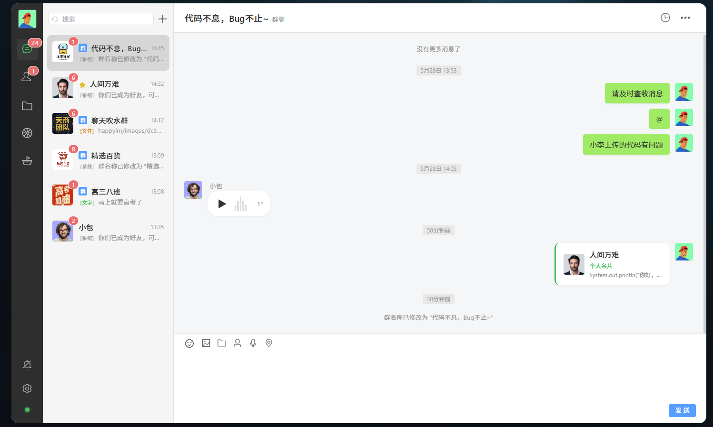
</p>

<p align="center">
  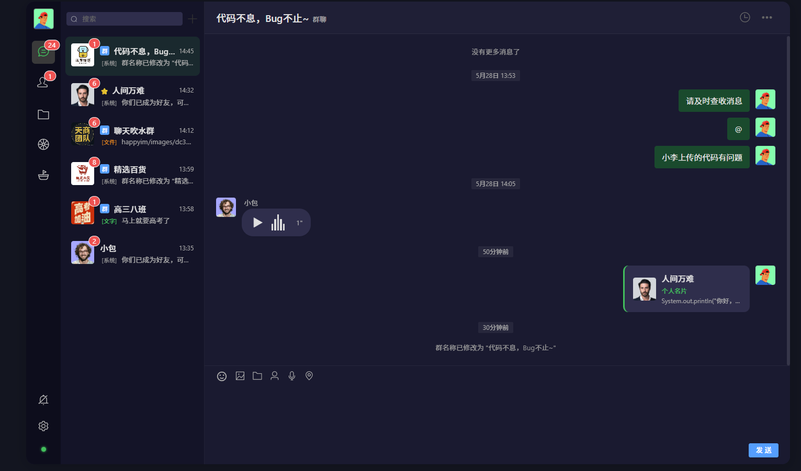
</p>

<p align="center">
  <b>Light / Dark Themes · WeChat-Inspired UI · Full-Stack Reference Implementation</b>
  <br/>
  <b>亮 / 暗双主题 · 仿微信交互 · 全栈参考实现</b>
</p>

---

English | 中文
--- | ---
HappyIM is a full-stack instant messaging application built with production-grade architecture patterns. It implements the complete feature set of a modern IM platform — one-on-one messaging, group chat, moments (timeline), public community, file management, and offline message delivery — with clean separation of concerns across the entire stack. | HappyIM 是一个基于生产级架构模式构建的全栈即时通讯应用。它实现了现代 IM 平台完整的核心功能 —— 单聊、群聊、朋友圈、公开社区、文件管理与离线消息推送 —— 在整个技术栈上做到了清晰的职责分离。
> Clone, run `docker-compose up`, and explore a fully functional IM system on your local machine. | > Clone 项目，执行 `docker-compose up`，即可在本地运行一个功能完善的 IM 系统。

---

## Versions · 版本

HappyIM is available in two architectural editions. Choose the one that matches your learning goals.

HappyIM 提供两种架构版本，根据学习目标选择。

| | Monolithic · 单体架构 | Microservices · 微服务架构 |
|---|---|---|
| **Branch · 分支** | [`master`](https://github.com/ruiichi1228-spec/happyIM) | [`microservices`](https://github.com/ruiichi1228-spec/happyIM/tree/microservices) |
| **Backend Structure · 后端结构** | `happyim-api` (REST) + `happyim-ws` (WebSocket) + `happyim-common` (共享模块) | `gateway` + `user-service` + `chat-service` + `chat-ws` + `content-service` + `api-contracts` + `happyim-common` |
| **API Gateway · API 网关** | ✗ — 前端直连各服务 | ✓ — Spring Cloud Gateway 统一入口 |
| **Inter-Service Communication · 服务间调用** | ✗ — 单进程直接调用 | ✓ — OpenFeign 声明式 RPC |
| **Service Discovery · 服务发现** | ✗ | Nacos |
| **Complexity · 复杂度** | 低 — 适合快速上手 | 中 — 适合学习分布式架构 |
| **Frontend · 前端** | 相同 | 相同 |

> The `microservices` branch is the actively developed mainline. The `master` branch preserves the monolithic version for those who prefer a simpler starting point.
>
> `microservices` 分支是当前活跃开发的主线。`master` 分支保留了单体版本，适合希望从简单架构起步的开发者。

### Which one should I choose? · 如何选择？

| Scenario · 场景 | Recommendation · 推荐 |
|---|---|
| You're new to IM systems or Spring Boot · 刚接触 IM 或 Spring Boot | Start with [`master`](https://github.com/ruiichi1228-spec/happyIM) — get a working system running first · 从 master 开始，先把系统跑通 |
| You've built monoliths and want to learn microservices · 已有单体经验，想学微服务 | Use [`microservices`](https://github.com/ruiichi1228-spec/happyIM/tree/microservices) — observe real service decomposition, gateway routing, and inter-service calls · 用 microservices 分支，理解服务拆分、网关路由、服务间调用 |
| You're preparing for system design interviews · 准备系统设计面试 | Study both — compare the two architectures to understand the trade-offs in practice · 两个都看，对比两种架构的权衡取舍 |

---

## Features · 功能

### Core Messaging · 核心消息

<p align="center">
  
</p>

English | 中文
--- | ---
**Persistent WebSocket connections** for real-time message delivery (not polling-based) | **WebSocket 长连接**，消息实时送达（非轮询）
Full media support: text, images, video, and file attachments, handled end-to-end | 全媒体类型支持：文字、图片、视频、文件，端到端打通
**Offline message delivery** — undelivered messages are queued and pushed when the recipient reconnects | **离线消息推送** —— 未送达的消息在接收者上线后自动推送
Message status tracking: Sending → Delivered → Read | 消息状态追踪：发送中 → 已送达 → 已读

<p align="center">
  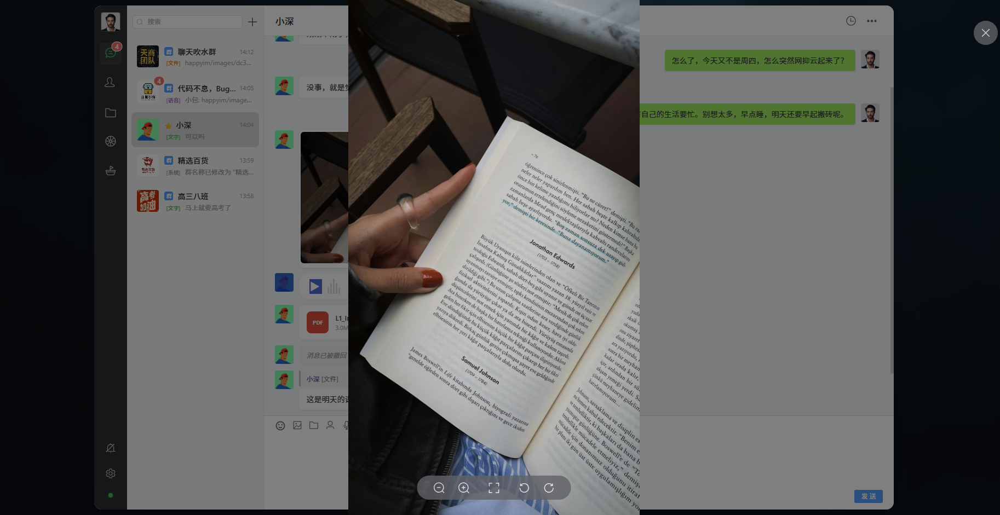
</p>

<p align="center">
  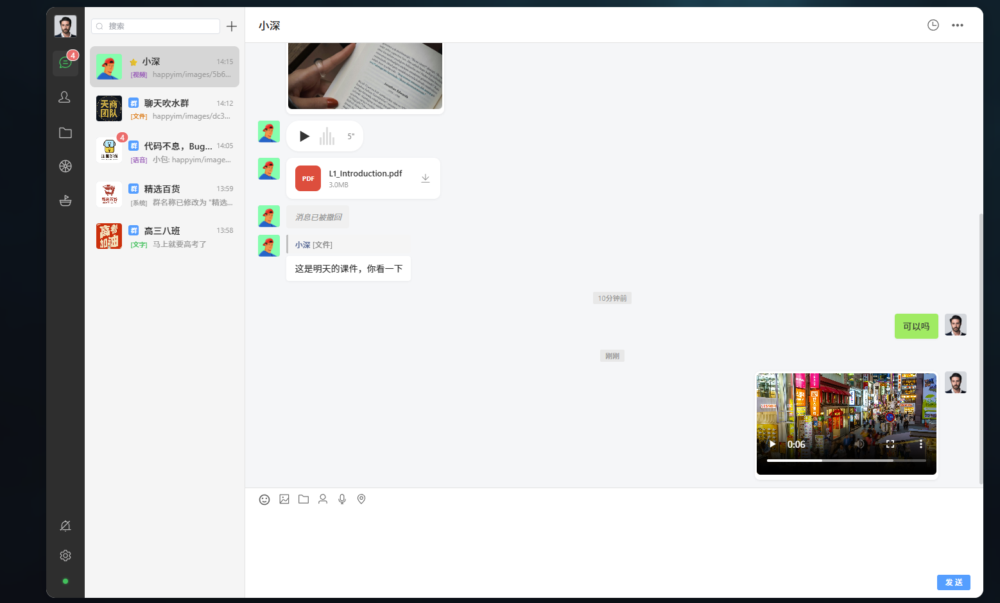
</p>

<p align="center">
  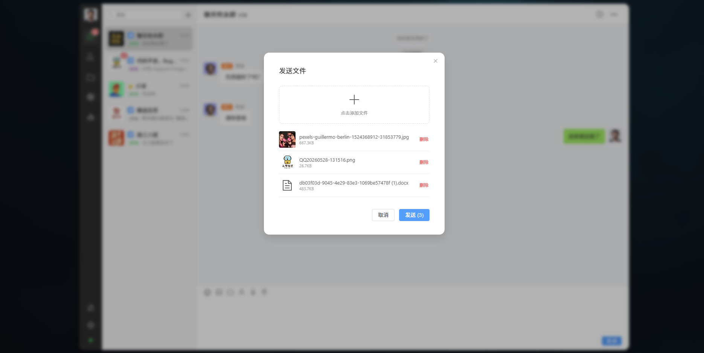
</p>

### Group Chat · 群聊

<p align="center">
  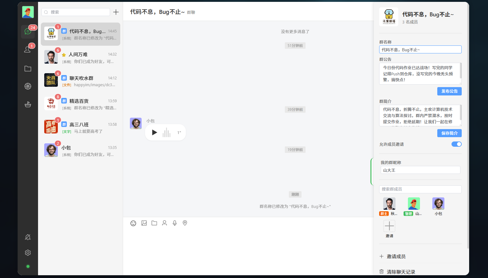
</p>

English | 中文
--- | ---
Group creation, member management, announcements, and mute controls. | 群创建、群成员管理、群公告、群禁言。

### Contacts Management · 联系人管理

<p align="center">
  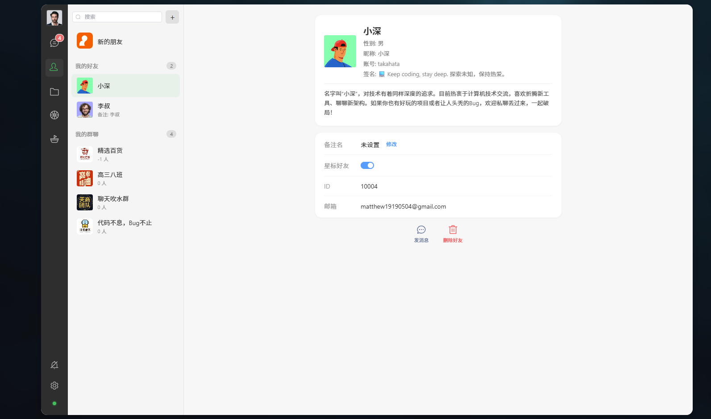
</p>

<p align="center">
  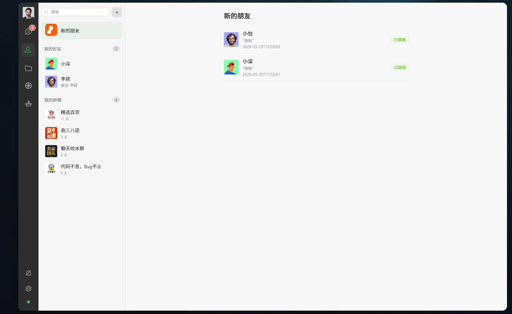
</p>

<p align="center">
  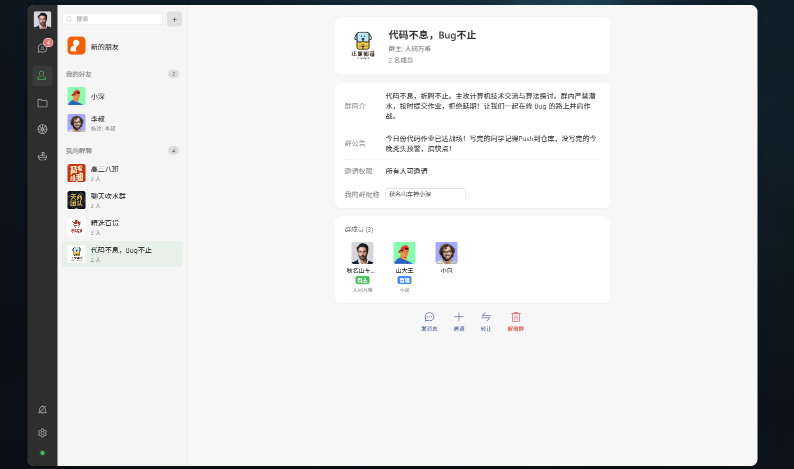
</p>

English | 中文
--- | ---
Search, add, remark, star, block; friend request approval flow; group CRUD operations. A complete social graph implementation. | 好友搜索 / 添加 / 备注 / 星标 / 黑名单；好友申请审批流；群组 CRUD。完整的好友关系链。

### User Profile Card · 个人名片

<p align="center">
  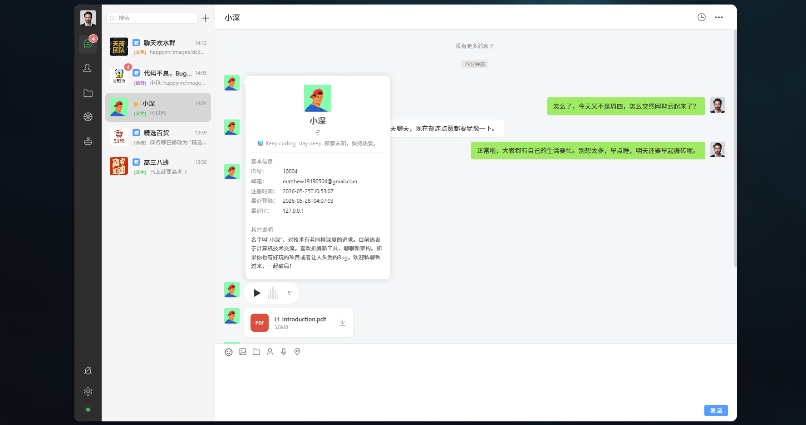
</p>

English | 中文
--- | ---
Click-to-expand profile cards showing detailed user information. | 点击头像弹出名片卡，查看详细资料。

### Moments (Timeline) · 朋友圈

<p align="center">
  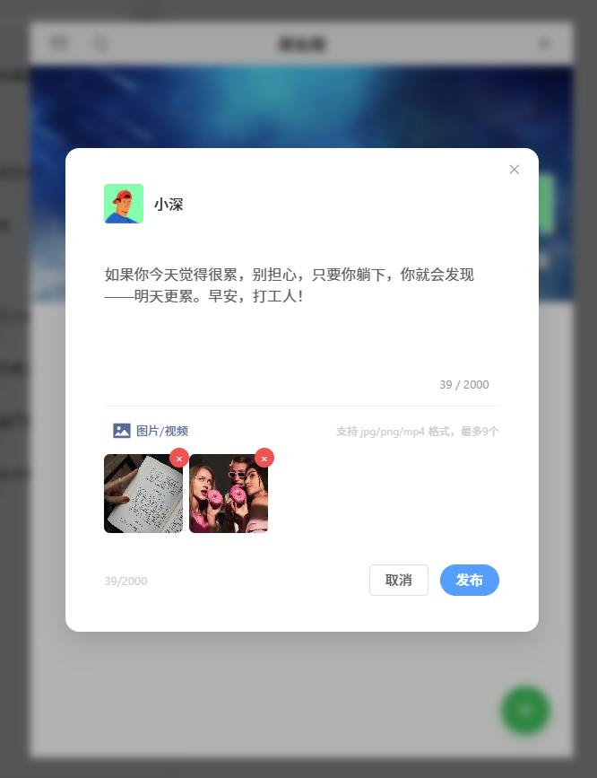
</p>

<p align="center">
  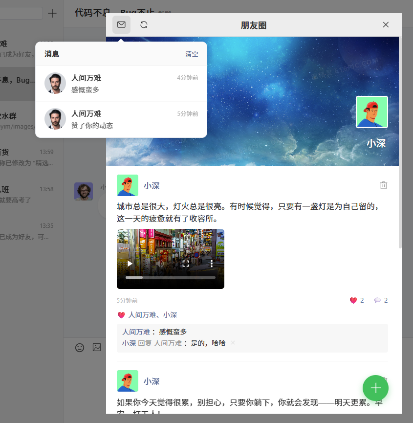
</p>

English | 中文
--- | ---
Photo/text posts, video posts, likes, comments, nested replies, and notification feed. | 图文 / 视频动态发布，点赞、评论、二级回复、消息通知。

### Public Square (Community) · 公开广场

<p align="center">
  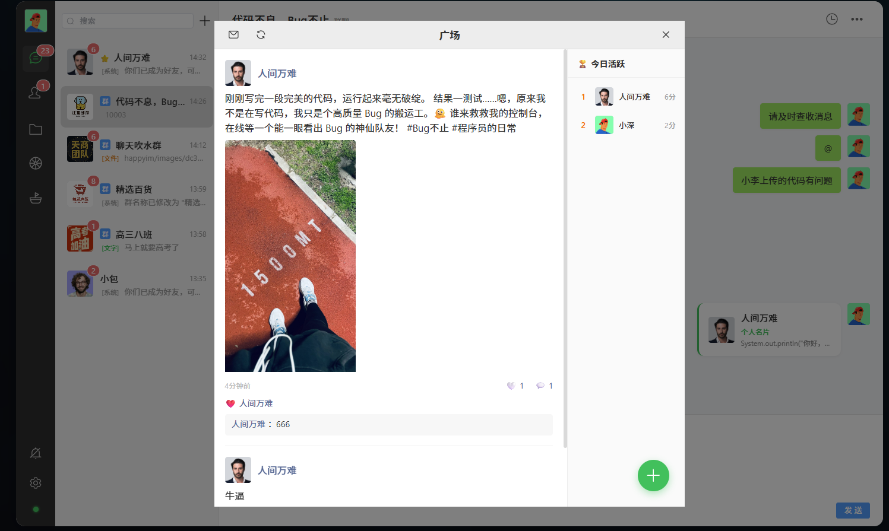
</p>

English | 中文
--- | ---
A public community space with daily activity leaderboard, posts, likes, and comments — implementing both private social and public community logic in one codebase. | 公开社区空间，包含今日活跃排行榜、发帖、点赞、评论 —— 一套代码同时覆盖私域社交与公域社区两种逻辑。

### File Manager · 文件管理

<p align="center">
  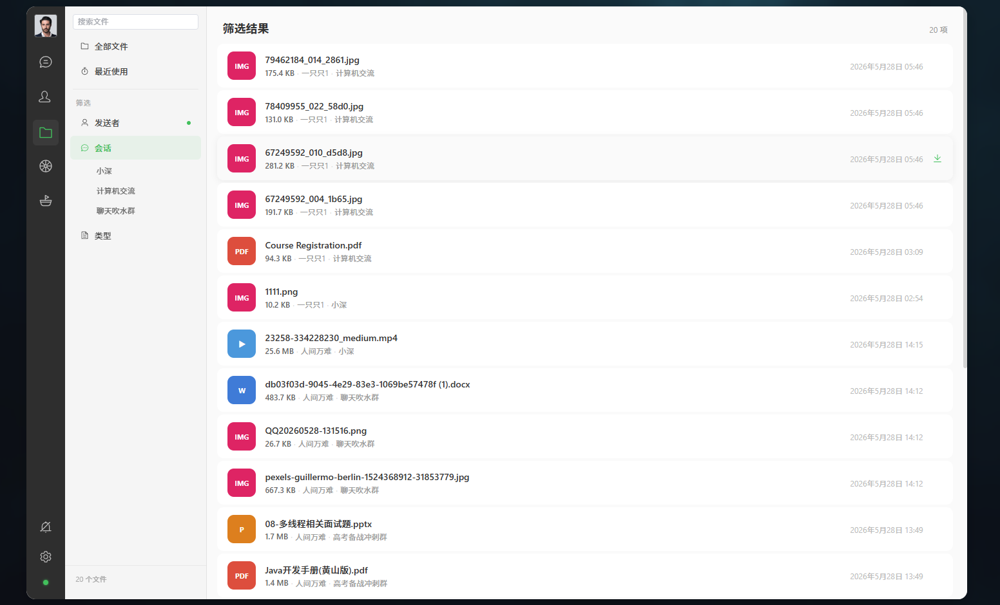
</p>

English | 中文
--- | ---
Centralized view of all files exchanged across conversations, filterable by type. | 所有会话中收发过的文件集中管理，按类型筛选。

### User Settings · 个人设置

<p align="center">
  
</p>

<p align="center">
  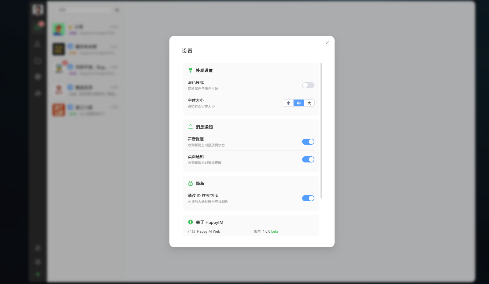
</p>

English | 中文
--- | ---
Avatar, nickname, bio, gender — edits propagate to all cached references across the system. | 修改头像、昵称、签名、性别 —— 编辑即时生效，全系统缓存同步更新。

### Authentication · 身份认证

<p align="center">
  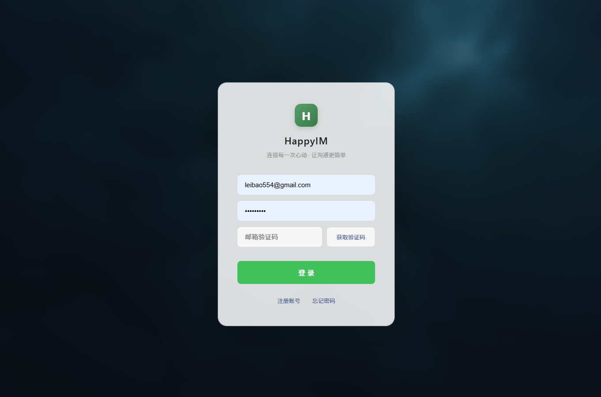
</p>

<p align="center">
  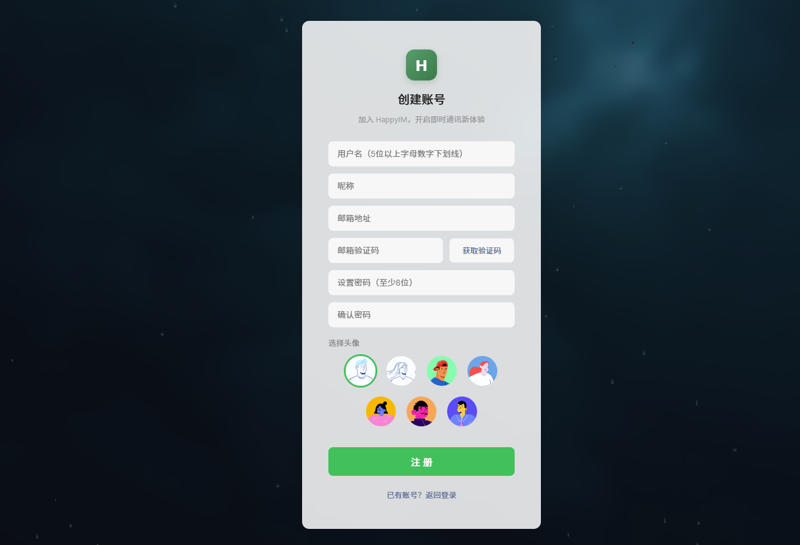
</p>

English | 中文
--- | ---
Email verification code registration, avatar selection at sign-up, glassmorphism UI with rain-drop effect. | 邮箱验证码注册、注册时选择默认头像、毛玻璃雨滴动效。

---

## Architecture · 技术架构

<p align="center">
  <b>Vue 3 SPA</b> ← HTTP / WebSocket → <b>Spring Cloud Gateway</b> → <b>Microservices</b> → <b>Message Queue</b> → <b>WebSocket Nodes</b><br/>
  &nbsp;&nbsp;&nbsp;&nbsp;&nbsp;&nbsp;&nbsp;&nbsp;&nbsp;&nbsp;&nbsp;&nbsp;&nbsp;&nbsp;&nbsp;&nbsp;&nbsp;&nbsp;&nbsp;&nbsp;&nbsp;&nbsp;&nbsp;&nbsp;&nbsp;&nbsp;&nbsp;&nbsp;&nbsp;&nbsp;&nbsp;&nbsp;&nbsp;&nbsp;&nbsp;&nbsp;&nbsp;&nbsp;&nbsp;&nbsp;&nbsp;&nbsp;&nbsp;&nbsp;&nbsp;&nbsp;&nbsp;&nbsp;&nbsp;&nbsp;&nbsp;&nbsp;&nbsp;&nbsp;&nbsp;&nbsp;&nbsp;&nbsp;&nbsp;&nbsp;&nbsp;&nbsp;&nbsp;&nbsp;&nbsp;↓&nbsp;&nbsp;&nbsp;&nbsp;&nbsp;&nbsp;&nbsp;&nbsp;&nbsp;&nbsp;&nbsp;&nbsp;&nbsp;&nbsp;&nbsp;&nbsp;&nbsp;&nbsp;&nbsp;&nbsp;&nbsp;&nbsp;&nbsp;&nbsp;↓&nbsp;&nbsp;&nbsp;&nbsp;&nbsp;&nbsp;&nbsp;&nbsp;&nbsp;&nbsp;&nbsp;&nbsp;&nbsp;&nbsp;&nbsp;&nbsp;&nbsp;&nbsp;&nbsp;&nbsp;&nbsp;&nbsp;&nbsp;&nbsp;↓<br/>
  &nbsp;&nbsp;&nbsp;&nbsp;&nbsp;&nbsp;&nbsp;&nbsp;&nbsp;&nbsp;&nbsp;&nbsp;&nbsp;&nbsp;&nbsp;&nbsp;&nbsp;&nbsp;&nbsp;&nbsp;&nbsp;&nbsp;&nbsp;&nbsp;&nbsp;&nbsp;&nbsp;&nbsp;&nbsp;&nbsp;&nbsp;&nbsp;&nbsp;&nbsp;&nbsp;&nbsp;&nbsp;&nbsp;&nbsp;&nbsp;&nbsp;&nbsp;&nbsp;&nbsp;&nbsp;&nbsp;&nbsp;&nbsp;&nbsp;&nbsp;&nbsp;&nbsp;&nbsp;&nbsp;&nbsp;&nbsp;&nbsp;&nbsp;MySQL&nbsp;&nbsp;&nbsp;&nbsp;&nbsp;&nbsp;&nbsp;&nbsp;&nbsp;Redis&nbsp;&nbsp;&nbsp;&nbsp;&nbsp;&nbsp;&nbsp;MongoDB&nbsp;&nbsp;&nbsp;&nbsp;&nbsp;&nbsp;&nbsp;MinIO
</p>

| Layer · 层级 | Technology · 技术栈 | Rationale · 选型理由 |
|---|---|---|
| Frontend Framework · 前端框架 | Vue 3 + Composition API + Vite | Reactive data flow, HMR-based rapid iteration · 响应式数据流，HMR 极速开发 |
| UI Library · UI 组件库 | Element Plus | Enterprise-grade components, built-in dark mode · 企业级组件，暗色主题开箱即用 |
| Backend Framework · 后端框架 | Spring Boot 3 + Spring Cloud Gateway | Industry-standard Java stack, microservice routing · Java 生态事实标准，微服务路由 |
| API Gateway · API 网关 | Spring Cloud Gateway | Unified entry point, route-based service dispatch · 统一入口，按路由分发服务 |
| Real-Time Communication · 实时通信 | WebSocket (Spring WebFlux) | Native protocol support, no external broker required · 原生协议支持，不依赖外部 Broker |
| Message Broker · 消息队列 | RabbitMQ | Decouples message send from delivery; enables horizontal scaling of WebSocket nodes · 解耦消息收发，WebSocket 节点可水平扩展 |
| Relational Database · 关系型数据库 | MySQL 8 | Structured data: users, friendships, groups · 用户、好友、群组等结构化数据 |
| Cache · 缓存 | Redis 7 | Verification codes, token blacklist, presence status · 验证码、Token 黑名单、在线状态 |
| Document Store · 文档数据库 | MongoDB 7 | Offline message persistence with flexible document schema · 离线消息持久化，灵活的文档 Schema |
| Object Storage · 对象存储 | MinIO | S3-compatible storage for images, video, and file attachments · S3 兼容，图片/视频/文件统一存储 |
| Authentication · 认证 | JWT Dual Token + BCrypt | Stateless auth with automatic token refresh · 无状态鉴权，自动续期 |
| Observability · 可观测性 | Prometheus + SkyWalking | Metrics collection and distributed tracing · 指标采集与分布式链路追踪 |
| Containerization · 容器化 | Docker Compose | One-command environment provisioning · 一键拉起全部基础设施 |

---

## Quick Start · 快速开始

```bash
# 1. Clone the repository · 克隆仓库
git clone https://github.com/ruiichi1228-spec/happyIM.git
cd happyIM

# 2. Start infrastructure services · 启动基础设施（MySQL, Redis, MongoDB, RabbitMQ, MinIO）
docker-compose up -d

# 3. Build & start backend services · 构建并启动后端服务
cd backend
mvn clean package -DskipTests
java -jar services/user-service/target/user-service-*.jar &
java -jar services/chat-service/target/chat-service-*.jar &
java -jar services/chat-ws/target/chat-ws-*.jar &
java -jar services/content-service/target/content-service-*.jar &
java -jar gateway/target/gateway-*.jar &

# 4. Start the frontend · 启动前端
cd frontend
npm install
npm run dev
```

Open `http://localhost:5173`, register two accounts, and exchange messages in real time.
<br/>
浏览器打开 `http://localhost:5173`，注册两个账号，即可在两个窗口互发消息。

---

## Project Structure · 项目结构

```
happyIM/
├── frontend/                        # Vue 3 SPA (~7,000 lines · 行)
│   └── src/
│       ├── pages/                   # ChatPage, MomentsPage, SquarePage, LoginPage, ...
│       ├── layouts/                 # MainLayout (sidebar navigation · 侧边栏导航)
│       ├── components/              # Reusable UI components · 通用组件
│       ├── utils/                   # WebSocket client, userCache, theme, HTTP client
│       └── router/                  # Vue Router configuration
├── backend/                         # Spring Boot microservices (~7,400 lines · 行)
│   ├── gateway/                     # Spring Cloud Gateway (API routing · API 路由)
│   ├── services/
│   │   ├── user-service/            # Authentication, user profiles, contacts · 认证、用户、联系人
│   │   ├── chat-service/            # Message persistence, conversation logic · 消息持久化、会话逻辑
│   │   ├── chat-ws/                 # WebSocket connections, real-time delivery · WebSocket 连接、实时推送
│   │   └── content-service/         # Moments, square posts, file management · 朋友圈、广场、文件管理
│   ├── happyim-common/              # Shared entities, DTOs, mappers, utilities · 共享实体、DTO、Mapper、工具类
│   └── api-contracts/               # Service interface definitions · 服务接口定义
├── docs/                            # Design documentation · 设计文档
│   ├── COMPLETE_ARCHITECTURE.md     # Full architecture report · 完整架构报告
│   ├── MESSAGE_PUSH_DESIGN.md       # Message push design · 消息推送设计
│   ├── CONVERSATION_ID_AND_REDIS_DESIGN.md  # 会话 ID 与 Redis 设计
│   └── ...                          # Additional design docs · 更多设计文档
├── nginx/                           # Nginx configuration · Nginx 配置
├── prometheus/                      # Prometheus configuration · Prometheus 配置
├── skywalking-agent/                # Distributed tracing agent · 分布式链路追踪探针
├── docker-compose.yml               # Local development infrastructure · 本地开发基础设施
└── README.md
```

---

## Learning Path · 学习路线

| Day · 天 | Focus · 重点 | Topics Covered · 学习内容 |
|---|---|---|
| Day 1 | Run the system · 运行系统 | Environment setup, registration, messaging — understand the full flow · 环境搭建、注册登录、收发消息，建立整体认知 |
| Day 2 | Authentication · 认证 | `LoginPage.vue` → Gateway → `AuthService` — registration, login, JWT dual-token · 注册登录前后端协作、JWT 双 Token 鉴权 |
| Day 3 | Real-time messaging · 实时消息 | `ChatPage.vue` + `websocket.js` → `ChatWebSocketHandler` — connection lifecycle, heartbeat, send/receive · WebSocket 连接建立、心跳保活、消息收发 |
| Day 4 | Message routing · 消息路由 | `MessageService` → RabbitMQ → `MessageConsumer` — how messages traverse the broker to reach the correct WebSocket node · 消息经队列路由至正确 WebSocket 节点 |
| Day 5 | Moments (Timeline) · 朋友圈 | `MomentsPage.vue` → `ContentService` — post creation, likes, comments, notification pipeline · 发布、点赞、评论、通知完整链路 |
| Day 6 | Public Square · 广场 | `SquarePage.vue` → `ContentService` — public feed, leaderboard · 公开帖子流与排行榜 |
| Day 7 | Extend the system · 扩展系统 | Message recall, stickers, voice messages — apply the patterns you've learned · 消息撤回、表情包、语音消息 —— 应用已掌握的模式 |

---

## About This Project · 关于项目

English | 中文
--- | ---
HappyIM is designed as a reference implementation for developers studying distributed instant messaging system architecture. With ~7,400 lines of Java and ~7,000 lines of TypeScript/Vue, it provides meaningful depth across both frontend and backend without being overwhelming. | HappyIM 定位为分布式即时通讯系统架构的参考实现，面向学习和研究用途。项目包含约 7,400 行 Java 与约 7,000 行 TypeScript/Vue 代码，在前后端均有足够的深度，同时规模可控，不会让学习陷入烂尾。

Key design decisions · 关键设计决策：

English | 中文
--- | ---
**Microservice decomposition** — user, chat, WebSocket, and content domains are separated into independent services behind an API gateway | **微服务拆分** —— 用户、消息、WebSocket、内容四个领域被拆分为独立服务，统一通过 API 网关接入
**Message queue integration** — RabbitMQ decouples message producers from consumers, enabling horizontal scaling of WebSocket nodes | **消息队列解耦** —— RabbitMQ 解耦消息生产与消费，使 WebSocket 节点可水平扩展
**Dual database strategy** — MySQL for relational data (users, groups, relationships); MongoDB for message storage with flexible schemas | **双数据库策略** —— MySQL 存储结构化关系数据（用户、群组、好友关系）；MongoDB 存储消息体，利用灵活的文档 Schema
**Stateless authentication** — JWT access + refresh token architecture with automatic renewal | **无状态认证** —— JWT 双 Token（Access + Refresh）架构，支持自动续期

---

## Star History · Star 历史

If this project is useful to you, consider giving it a star to help others discover it and to support ongoing maintenance.
<br/>
如果这个项目对你有帮助，点个 Star 让更多人看到，也让维护者知道有人在用。

---

## License · 许可证

MIT — Free to use, modify, and distribute. · 可自由使用、修改和分发。
